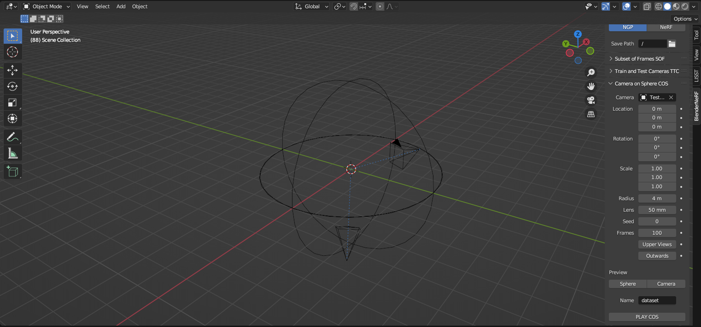
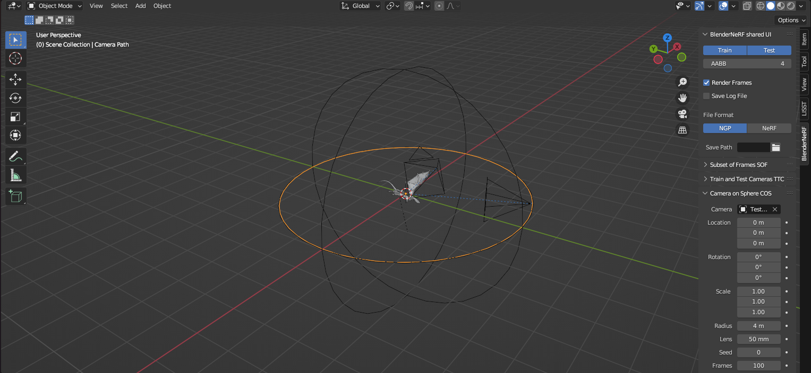

# PointNeRF-Assistant
## Overview

This is a repository is an assistant to set up PointNeRF. We set up a stable environment for point-nerf for ubuntu 20.04, and modified point-nerf code to fix some bug during running. We also share a pipeline to generate your own dataset using [BlenderNeRF](https://github.com/maximeraafat/BlenderNeRF). We extends from the original repository of [PointNeRF](https://github.com/Xharlie/pointnerf).

## Installation

### Requirements

All the codes are tested in the following environment: Python 3.8; Ubuntu 20.04; CUDA > 11.7.

### Install

* Install the environment from `yml`:

  ```bash
  conda env create -f environment.yml
  ```

* In mainland China:

  ```
  conda env create -f environment_autodl.yml
  ```
  
* Install `pytorch3d`

  ```bash
  conda activate point-nerf
  pip install fvcore iopath
  pip install --no-index --no-cache-dir pytorch3d -f https://dl.fbaipublicfiles.com/pytorch3d/packaging/wheels/py39_cu117_pyt1131/download.html
  ```

## Data Preparation

For the data preparation for traditional NeRF dataset, please see [PointNeRF](https://github.com/Xharlie/pointnerf). We also show a pipeline to create your own dataset using [BlenderNeRF](https://github.com/maximeraafat/BlenderNeRF). This pipeline is only applicable to `nerf_synthetic` data, please put the dataset in the `./data_src/nerf/nerf_synthetic` folder. 

* Install [Blender](https://www.blender.org/download/) and [BlenderNeRF](https://github.com/maximeraafat/BlenderNeRF) add-on.

* Download our [Blender template](https://drive.google.com/file/d/1-k3-4-fvnN4Ct_t81ffOQ6Hs4TEf4_uQ/view?usp=sharing).

  

* Open the template, import the target object and rescale it such that the object is within the `BlenderNeRF Sphere`

  

* Press `space` to check the camera poses and scale are correct. You can set background to be transparent in `Film` option of `Render Properties` tag.

  

* There are two options to generate dataset

  * Random camera pose around the sphere: Select `Camera on Sphere COS` option in `BlenderNeRF add-on`, chose `BlenderNeRF Camera`, run `PLAY COS`.

  * Continuous camera pose rotate w.r.t z-axis: Select `Subset of Frames SOF` option in `BlenderNeRF add-on`, chose `Test Camera`, run `PLAY SOF`.

* Decompress the zip file, open the `json` files, remove all suffix `.png`. And duplicate the `train` folder as `eval` folder and `test` folder, create corresponding `json` files (`transforms_eval.json`,  `transforms_test.json`)

* Create corresponding scripts (e.g. `dragon_cuda.sh` ), note that you only need to change the `name`, `scan` options first in the bash file.  

## Initialization and Optimization

### Download pre-trained MVSNet checkpoints:

You can Download ''MVSNet'' directory from [google drive](https://drive.google.com/drive/folders/1xk1GhDhgPk1MrlX8ncfBz5hNMvSa9vS6?usp=sharing) and place them under `checkpoints/`. Please check [PointNeRF](https://github.com/Xharlie/pointnerf) for more details. 

### Per-scene optimize from scatch

This environment only supports `pytorch3d` implementations:

<details>
  <summary>train scripts</summary>

```
    bash dev_scripts/w_n360/chair_cuda.sh
    bash dev_scripts/w_n360/drums_cuda.sh
    bash dev_scripts/w_n360/ficus_cuda.sh
    bash dev_scripts/w_n360/hotdog_cuda.sh
    bash dev_scripts/w_n360/lego_cuda.sh
    bash dev_scripts/w_n360/materials_cuda.sh
    bash dev_scripts/w_n360/mic_cuda.sh
    bash dev_scripts/w_n360/ship_cuda.sh
```
</details>

## Point Initialization / Generalization:
### &nbsp; Download pre-trained MVSNet checkpoints:
We trained [MVSNet](https://github.com/xy-guo/MVSNet_pytorch) on DTU. You can Download ''MVSNet'' directory from 
[google drive](https://drive.google.com/drive/folders/1xk1GhDhgPk1MrlX8ncfBz5hNMvSa9vS6?usp=sharing)
and place them under '''checkpoints/'''

### &nbsp;  Train 2D feature extraction and point representation
#####  &nbsp; Directly use our trained checkpoints files:
Download ''init'' directory from 
[google drive](https://drive.google.com/drive/folders/1xk1GhDhgPk1MrlX8ncfBz5hNMvSa9vS6?usp=sharing).
and place them under '''checkpoints/'''

##### &nbsp; Or train from scratch:
Train for point features of 63 channels (as in paper) 
```
bash dev_scripts/ete/dtu_dgt_d012_img0123_conf_color_dir_agg2.sh
```
Train for point features of 32 channels (better for per-scene optimization)
```
bash dev_scripts/ete/dtu_dgt_d012_img0123_conf_agg2_32_dirclr20.sh
```
After the training, you should pick a checkpoint and rename it to best checkpoint, e.g.:
```
cp checkpoints/dtu_dgt_d012_img0123_conf_color_dir_agg2/250000_net_ray_marching.pth  checkpoints/dtu_dgt_d012_img0123_conf_color_dir_agg2/best_net_ray_marching.pth

cp checkpoints/dtu_dgt_d012_img0123_conf_color_dir_agg2/250000_net_mvs.pth  checkpoints/dtu_dgt_d012_img0123_conf_color_dir_agg2/best_net_mvs.pth
```
### &nbsp; Test feed forward inference on dtu scenes 
These scenes that are selected by MVSNeRF, please also refer their code to understand the metrics calculation.
```
bash dev_scripts/dtu_test_inf/inftest_scan1.sh
bash dev_scripts/dtu_test_inf/inftest_scan8.sh
bash dev_scripts/dtu_test_inf/inftest_scan21.sh
bash dev_scripts/dtu_test_inf/inftest_scan103.sh
bash dev_scripts/dtu_test_inf/inftest_scan114.sh
```

## Per-scene Optimization:


(Please visit the project sites to see the original videos of above scenes, which have quality loss when being converted to gif files here.)
### Download per-scene optimized Point-NeRFs
 You can skip training and download the folders of ''nerfsynth'', ''tanksntemples'' and ''scannet'' here [google drive](https://drive.google.com/drive/folders/1xk1GhDhgPk1MrlX8ncfBz5hNMvSa9vS6?usp=sharing), and place them in ''checkpoints/''.

```
pointnerf
├── checkpoints
│   ├── init
    ├── MVSNet
    ├── nerfsynth
    ├── col_nerfsynth
    ├── scannet
    ├── tanksntemples
```

In each scene, we provide initialized point features and network weights ''0_net_ray_marching.pth'', points and weights at 20K steps ''20000_net_ray_marching.pth'' and 200K steps ''200000_net_ray_marching.pth''

### Test the per-scene optimized Point-NeRFs
#### NeRF Synthetics
<details>
  <summary>test scripts</summary>
  
```
    bash dev_scripts/w_n360/chair_test.sh
    bash dev_scripts/w_n360/drums_test.sh
    bash dev_scripts/w_n360/ficus_test.sh
    bash dev_scripts/w_n360/hotdog_test.sh
    bash dev_scripts/w_n360/lego_test.sh
    bash dev_scripts/w_n360/materials_test.sh
    bash dev_scripts/w_n360/mic_test.sh
    bash dev_scripts/w_n360/ship_test.sh
```
</details>


#### ScanNet
<details>
  <summary>test scripts</summary>
  
```
    bash dev_scripts/w_scannet_etf/scane101_test.sh
    bash dev_scripts/w_scannet_etf/scane241_test.sh
```
</details>

#### Tanks & Temples
<details>
  <summary>test scripts</summary>

```
    bash dev_scripts/w_tt_ft/barn_test.sh
    bash dev_scripts/w_tt_ft/caterpillar_test.sh
    bash dev_scripts/w_tt_ft/family_test.sh
    bash dev_scripts/w_tt_ft/ignatius_test.sh
    bash dev_scripts/w_tt_ft/truck_test.sh
```
</details>

### Per-scene optimize from scatch 
Make sure the ''checkpoints'' folder has ''init'' and ''MVSNet''.
The training scripts will start to do initialization if there is no ''.pth'' files in a scene folder. It will start from the last ''.pth'' files until reach the iteration of ''maximum_step''.

#### NeRF Synthetics using MVSNet (w/ alpha channel filtering during point cloud reconstruction and pycuda)
<details>
  <summary>train scripts</summary>

```
    bash dev_scripts/w_n360/chair.sh
    bash dev_scripts/w_n360/drums.sh
    bash dev_scripts/w_n360/ficus.sh
    bash dev_scripts/w_n360/hotdog.sh
    bash dev_scripts/w_n360/lego.sh
    bash dev_scripts/w_n360/materials.sh
    bash dev_scripts/w_n360/mic.sh
    bash dev_scripts/w_n360/ship.sh
```
</details>


#### NeRF Synthetics using MVSNet (w/ background color filtering during point cloud reconstruction and pytorch cuda)
<details>
  <summary>train scripts</summary>

```
    bash dev_scripts/w_n360/chair_cuda.sh
    bash dev_scripts/w_n360/drums_cuda.sh
    bash dev_scripts/w_n360/ficus_cuda.sh
    bash dev_scripts/w_n360/hotdog_cuda.sh
    bash dev_scripts/w_n360/lego_cuda.sh
    bash dev_scripts/w_n360/materials_cuda.sh
    bash dev_scripts/w_n360/mic_cuda.sh
    bash dev_scripts/w_n360/ship_cuda.sh
```
</details>

#### NeRF Synthetics using COLMAP points
Please download the COLMAP data (see above). If there is {maximum_step}.pth checkpoint files in the path, the scripts below will also run test.
<details>
  <summary>train scripts</summary>

```
    bash dev_scripts/w_colmap_n360/col_chair.sh
    bash dev_scripts/w_colmap_n360/col_drums.sh
    bash dev_scripts/w_colmap_n360/col_ficus.sh
    bash dev_scripts/w_colmap_n360/col_hotdog.sh
    bash dev_scripts/w_colmap_n360/col_lego.sh
    bash dev_scripts/w_colmap_n360/col_materials.sh
    bash dev_scripts/w_colmap_n360/col_mic.sh
    bash dev_scripts/w_colmap_n360/col_ship.sh
```
</details>

#### ScanNet
<details>
  <summary>train scripts</summary>

```
    bash dev_scripts/w_scannet_etf/scene101.sh
    bash dev_scripts/w_scannet_etf/scene241.sh
```
</details>

#### Tanks & Temples
<details>
  <summary>train scripts</summary>

```
    bash dev_scripts/w_tt_ft/barn.sh
    bash dev_scripts/w_tt_ft/caterpillar.sh
    bash dev_scripts/w_tt_ft/family.sh
    bash dev_scripts/w_tt_ft/ignatius.sh
    bash dev_scripts/w_tt_ft/truck.sh
```
</details>


## Acknowledgement

This repo is developed based on [PointNeRF](https://github.com/Xharlie/pointnerf). Please cite the corresponding papers. 

```
@inproceedings{xu2022point,
  title={Point-nerf: Point-based neural radiance fields},
  author={Xu, Qiangeng and Xu, Zexiang and Philip, Julien and Bi, Sai and Shu, Zhixin and Sunkavalli, Kalyan and Neumann, Ulrich},
  booktitle={Proceedings of the IEEE/CVF Conference on Computer Vision and Pattern Recognition},
  pages={5438--5448},
  year={2022}
}
```

## LICENSE

The code is released under the GPL-3.0 license.
